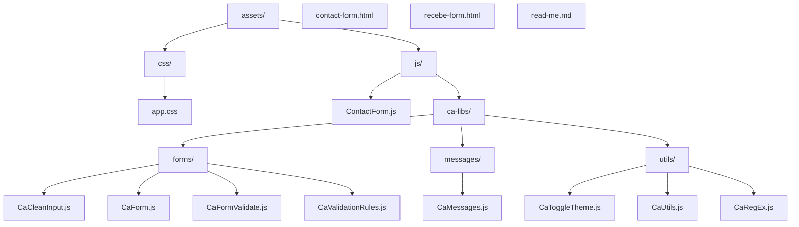

# Formulário de Contato

## Estrutura do Projeto

```
├── assets   # Arquivos estáticos do projeto
│   ├── css
│   │   └── app.css   # CSS custimozado da App
│   └── js
│       ├── ContactForm.js   # JS principal do formulário de contato
│       └── ca-libs          # Biblioteca JS reutilizáveis
│           ├── forms                    # JS para manipulação e validação de forms
│           │   ├── CaCleanInput.js      # - Limpeza e formatação dos campos de forms
│           │   ├── CaForm.js            # - Form Base, classe base de todos os forms
│           │   ├── CaFormValidate.js    # - Classe estática, Funções de validação para forms
│           │   └── CaValidationData.js  # - Dados auxiliares para validação
│           ├── messages                 # Reune todas as mensagens de usuário, todos os idiomas
│           │   └── CaMessages.js        # - Por simplificação, no momento apenas pt-br
│           └── utils                    # Funções utilitárias
│               │── CaUtils.js           # - Outras funções utilitárias
│               └── CaToggleTheme.js     # - Faz alternância entre os temas light/dark
├── contact-form.html   # HTML principal do form de contato
├── recebe-form.html    # HTML teste para exibir o submit do form contato
└── read-me.md          # Documentação do projeto
```



### Estrutura Geral

- **[`contact-form.html`](contact-form.html)**
  - Página principal com o formulário de contato, usando Bootstrap e tema customizável.
- **[`recebe-form.html`](recebe-form.html)**
  - Página que exibe os dados recebidos do formulário.

- **assets/**
  - **[`assets/css/app.css`](assets/css/app.css)**
    - Estilos customizados, incluindo suporte a tema claro/escuro.
  - **[`assets/js/ContactForm.js`](assets/js/ContactForm.js)**
    - Classe principal que inicializa e gerencia o formulário.
  - **js/ca-libs/**
    - **forms/**
      - [`CaForm.js`](assets/js/ca-libs/forms/CaForm.js): Gerencia eventos e validação do formulário.
      - [`CaFormValidate.js`](assets/js/ca-libs/forms/CaFormValidate.js): Funções de validação dos campos.
      - [`CaCleanInput.js`](assets/js/ca-libs/forms/CaCleanInput.js): Limpeza e formatação dos campos.
      - [`CaValidationData.js`](assets/js/ca-libs/forms/CaValidationData.js): Dados auxiliares (DDDs, domínios de email).
    - **messages/**
      - [`CaMessages.js`](assets/js/ca-libs/messages/CaMessages.js): Mensagens de erro e conjuntos de palavras.
    - **utils/**
      - [`CaUtils.js`](assets/js/ca-libs/utils/CaUtils.js): Funções utilitárias gerais.
      - [`CaToggleTheme.js`](assets/js/ca-libs/utils/CaToggleTheme.js): Alternância de tema claro/escuro.

## Validações

##### Formulário de Contato

- *Nome*:
  1. Não pode ser vazio
  1. Precisa ter nome e sobrenome
- *E-mail*:
  1. Não pode ser vazio
  1. E-mail precisa ser válido
  1. O domínio do e-mail precisa ser conhecido, popular.
- *Telefone*:
  1. Não pode ser vazio
  1. Precisa ter 10 ou 11 digitos, telefone fixo ou celular
  1. O DDD precisa ser válido
  1. No caso de números de telefones celulares, o 3º digito precisa ser '9'.
- *Mensagem*:
  1. Não pode ser vazio
  1. Precisa ter mais de 80 caracteres, cálculo feito após formatado.

## Trabalhos Futuros

- O método do formulário está como `PUT`, mas o correto para envio de formulários é `POST`.
   - Isso foi feito para não precisar implementar um backend para [recebe-form.html](recebe-form.html).

- A página [recebe-form.html](recebe-form.html) apenas exibe os dados recebidos via URL.

- Internalização, o primeiro passo foi dado. Todas as mensagens para o usuário estão em um arquivo separado [CaMessages.js](./assets/js/messages/CaMessages.js).

## 👨‍💻 Autor

- Prof. Carlos Augusto de S. Almeida
- Junho de 2025
